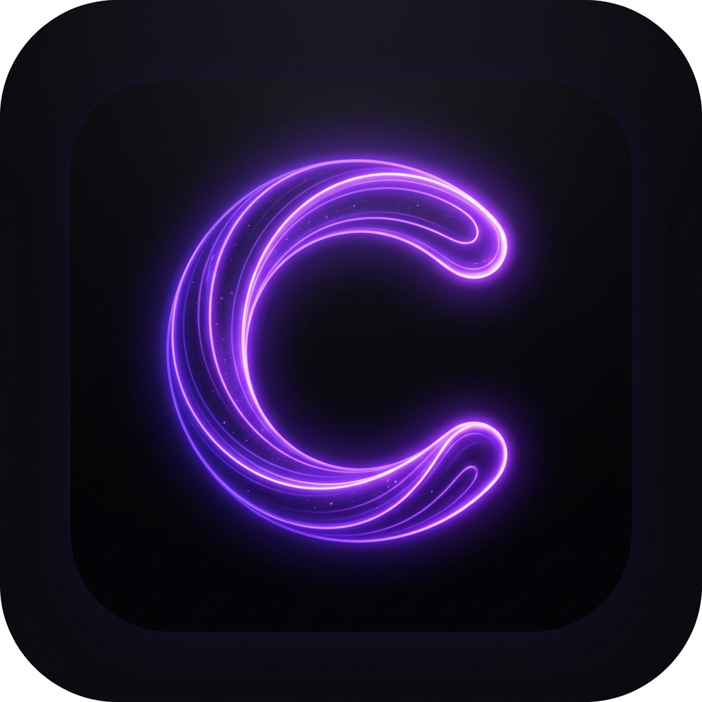

# 🌐 Calopsia Browser

<p align="center">
  
</p>

<p align="center">
  <strong>A professional Chromium-based browser built with Electron</strong><br/>
  Cross-platform · macOS · Windows · Linux
</p>

<p align="center">
  
  
  
  
</p>

---

## ✨ Features

| Feature | Description |
|---------|-------------|
| 🗂 **Multi-tab** | Full tab management with keyboard shortcuts |
| 🛡 **Ad Blocker** | Built-in ad & tracker blocking |
| ⭐ **Bookmarks** | Save, view, and remove bookmarks |
| 🕐 **History** | Persistent browsing history with date grouping |
| 📥 **Downloads** | Integrated download manager with progress tracking |
| 🔍 **Find in Page** | In-page text search |
| 🎨 **Dark UI** | Professional dark glass-morphism design |
| ⌨️ **Shortcuts** | Full keyboard navigation |
| 🔒 **Security** | CSP, context isolation, sandboxed renderer |
| 🌐 **Cross-platform** | macOS (Intel + Apple Silicon), Windows, Linux |

---

## 🚀 Quick Start

```bash
# Clone
git clone https://github.com/YOUR_USERNAME/calopsia-browser.git
cd calopsia-browser

# Install
npm install

# Run in dev mode
npm start

# Or with DevTools
npm run dev
```

---

## 🏗 Build

| Command | Output |
|---------|--------|
| `npm run build:mac` | `.dmg` + `.zip` (x64, arm64) |
| `npm run build:win` | `.exe` NSIS installer + portable |
| `npm run build:linux` | `.AppImage` + `.deb` + `.rpm` |
| `npm run build:all` | All platforms |

---

## ⌨️ Keyboard Shortcuts

| Shortcut | Action |
|----------|--------|
| `Ctrl/⌘ + T` | New tab |
| `Ctrl/⌘ + W` | Close tab |
| `Ctrl/⌘ + L` | Focus address bar |
| `Ctrl/⌘ + R` | Reload |
| `Ctrl/⌘ + D` | Bookmark page |
| `Ctrl/⌘ + F` | Find in page |
| `Ctrl/⌘ + B` | Bookmarks panel |
| `Ctrl/⌘ + Y` | History panel |
| `Ctrl/⌘ + +/-/0` | Zoom in / out / reset |
| `Ctrl/⌘ + 1-9` | Switch to tab |
| `Alt + ←/→` | Back / Forward |

---

## 📁 Project Structure

```
calopsia-browser/
├── .github/
│   └── workflows/
│       ├── build.yml        ← Cross-platform build & release
│       └── ci.yml           ← Lint & validation
├── assets/
│   ├── icons/               ← App icons (add icon.png, .ico, .icns)
│   └── entitlements.mac.plist
├── src/
│   ├── main/
│   │   └── main.js          ← Electron main process
│   ├── preload/
│   │   └── preload.js       ← Context bridge (secure IPC)
│   └── renderer/
│       ├── index.html       ← Browser chrome UI
│       ├── style.css        ← Dark glass-morphism design system
│       └── renderer.js      ← UI logic
├── package.json
└── README.md
```

---

## 🖼 Adding Your Logo

Place your logo files in `assets/icons/`:
- `icon.png` (512×512 or 1024×1024, used everywhere)
- `icon.ico` (Windows)
- `icon.icns` (macOS)

You can convert a PNG to these formats with:
```bash
# macOS icns
iconutil -c icns icon.iconset

# Windows ico (using ImageMagick)
convert icon.png -resize 256x256 icon.ico
```

---

## 🔖 Creating a Release

```bash
git tag v1.0.0
git push origin v1.0.0
```

GitHub Actions will automatically build all platforms and create a release.

---

## 📄 License

MIT © Calopsia Team
